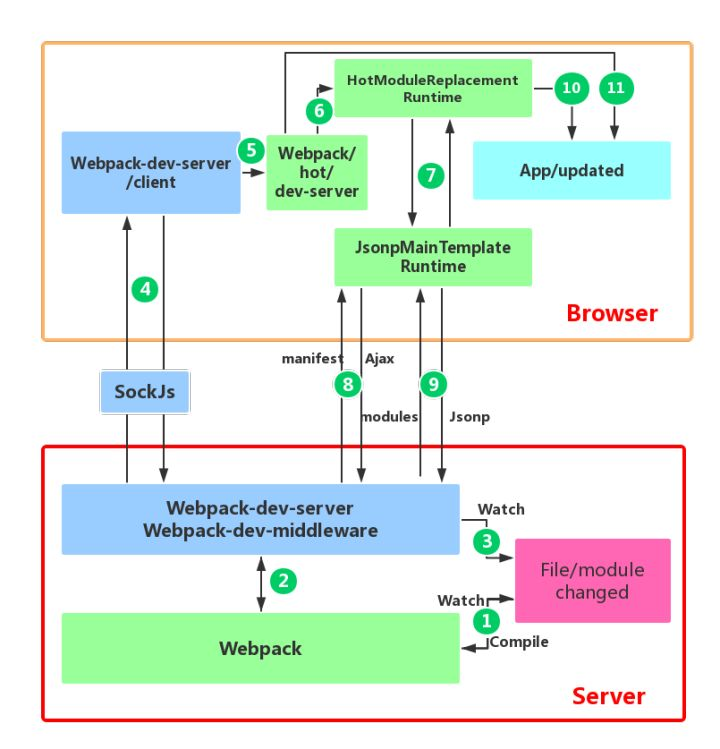

# webpack 模块热替换

- [webpack 模块热替换](#webpack-模块热替换)
  - [概念](#概念)
  - [原理](#原理)
  - [指南](#指南)
  - [API](#api)
  - [参考](#参考)

## 概念

模块热替换(HMR - hot module replacement)功能会在应用程序运行过程中，替换、添加或删除 模块，而无需重新加载整个页面

## 原理

> 上图底部红色框内是服务端，上面的橙色框是浏览器端。  
> 绿色方框 是 webpack 代码控制的区域。 
> 蓝色方框 是 webpack-dev-server 代码控制的区域， 
> 洋红方框 是文件系统，文件修改后的变化就发生在这， 
> 青色方框 是应用本身。

## 指南

## API

## 参考

- [Webpack HMR 原理解析](https://zhuanlan.zhihu.com/p/30669007)
- [Webpack 概念：模块热替换](https://webpack.docschina.org/concepts/hot-module-replacement/)
- [Webpack 指南：模块热替换](https://webpack.docschina.org/guides/hot-module-replacement)
- [Webpack API：模块热替换](https://webpack.docschina.org/api/hot-module-replacement/)
